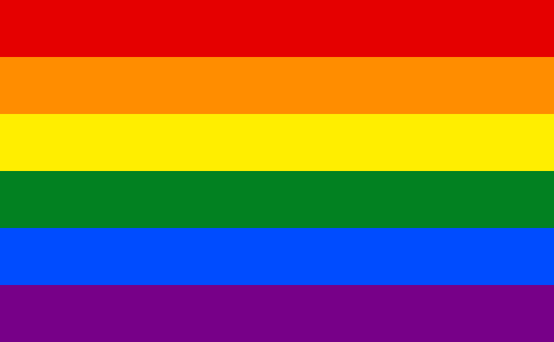

# pride-overlay

|        base image        |      [overlay](examples/overlay.rs)      |        [ring](examples/ring.rs)         |
| :----------------------: | :--------------------------------------: | :-------------------------------------: |
|  |  |  |

> overlay pride flags on images

[documentation](https://docs.rs/pride-overlay)

### supported flags

|    flag     |                    image                    |
| :---------: | :-----------------------------------------: |
|   rainbow   |          |
| transgender |  |
|  intersex   |        |

is there a flag you want to see added? [open an issue](https://github.com/isitreallyalive/pride-overlay/issues/new?template=flag-request.md)
